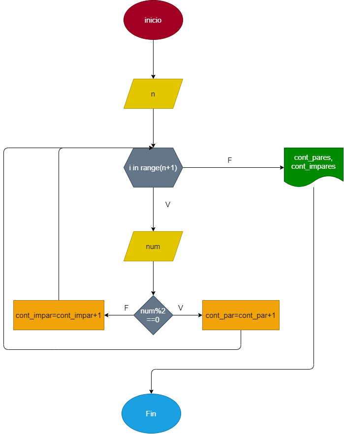

# Pares_impares_for

# Hacer el diagrama de flujo y programa en python, que lea 100 numeros enteros ( 3 o 4) y que averigue e imprima cuantos son pares y cuantos son impares 

## Diagrama de flujo 

